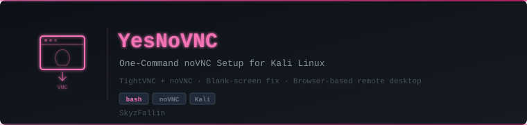

<p align="center">
  
</p>

<p align="center">
  
  
  
  
  
</p>

# YesNoVNC

One-command noVNC setup for Kali Linux. Get browser-based remote desktop access in under a minute.

**Author:** [SkyzFallin](https://github.com/SkyzFallin)

## Quick Start

```bash
git clone https://github.com/SkyzFallin/YesNoVNC.git
cd YesNoVNC
sudo ./install-novnc.sh
```

Then:
```bash
start-novnc     # start VNC server + noVNC proxy
stop-novnc      # stop everything
```

Access via browser: `http://localhost:6080/vnc.html`

Default VNC password: `password` (change with `vncpasswd`)

## What It Does

The install script handles everything:

- Installs dependencies (`tightvncserver`, `git`, `xfce4`, `dbus-x11`)
- Sets up VNC password and xstartup (with the blank screen fix)
- Clones noVNC to `/opt/noVNC`
- Installs `start-novnc` and `stop-novnc` commands to `/usr/local/bin`

## Details

| Item | Value |
|------|-------|
| VNC Display | `:1` |
| VNC Port | `5901` |
| noVNC Port | `6080` |
| Resolution | `1920x1080` |
| Desktop | XFCE4 |

## Troubleshooting

**Blank screen:** The install script already applies the fix (`unset SESSION_MANAGER` / `unset DBUS_SESSION_BUS_ADDRESS` in `~/.vnc/xstartup`). If you still get a blank screen, restart with `stop-novnc && start-novnc`.

**Can't connect on port 6080:** Check that websockify is running: `ps aux | grep websockify`. Check logs: `cat /tmp/novnc.log`.

**Change resolution:** Edit `start_novnc.sh` and change the `-geometry` value (e.g., `2560x1440`, `3840x2160`).

**Change VNC password:** Run `vncpasswd`, then `stop-novnc && start-novnc`.

## License

GPL-3.0
